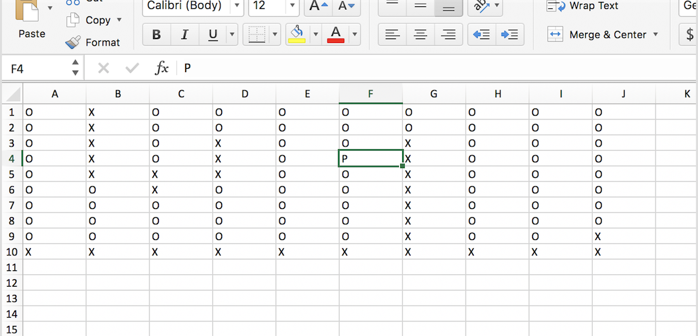
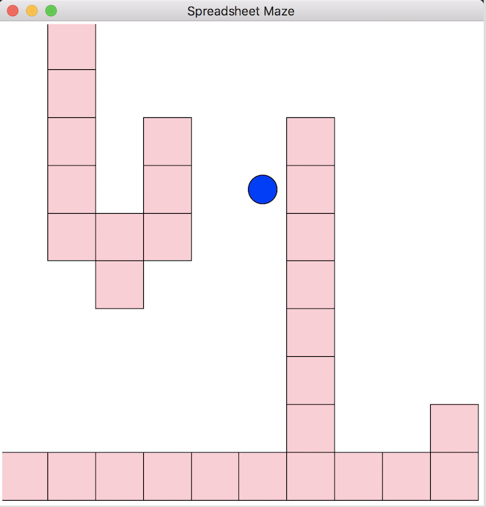

Small experiment with Tkinter - this is a maze game where the levels can be designed in an Excel spreadsheet.

#### Features
- Place starting player at any point in grid.
- Board scales to window.
- Select CSV from GUI.
- Dynamic window resizing / maze scaling.

#### Todo
- Add "checkpoint/finish" square.
- Add progress/save files.
